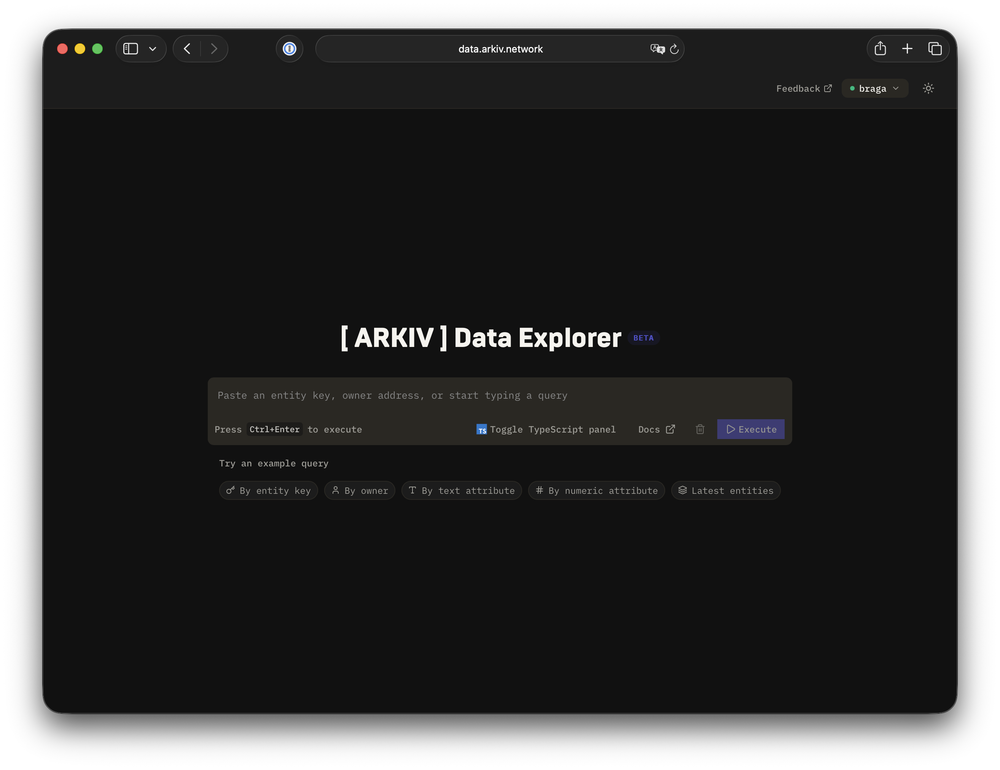

import { Aside } from '@astrojs/starlight/components';

<Aside type="caution">
Braga shuts down at 23:59 CET on 12 August 2026. After that the Data Explorer has nothing to read until the next public testnet — see the [Braga page](/networks/braga/) for the full story.
</Aside>

The [Arkiv Data Explorer](https://data.arkiv.network?utm_source=docs&utm_medium=referral&utm_campaign=data-explorer&utm_content=docs-page-hero) is a browser-based tool for querying and inspecting entities on Arkiv testnets. Reach for it when you want to verify that your app wrote what you expected, prototype a query before putting it in code, or simply explore what's on a testnet.

## Query editor

The query editor at the top of the Explorer accepts Arkiv's full query syntax — operators, attribute types, glob matching, and range filters.

For the full reference, see [Query syntax](/json-rpc/querying-data/#query-syntax).

## Searching for entities or owners

Paste a raw value directly into the editor and the Explorer normalises it automatically:

- A 32-byte hex string becomes `$key = "0x…"`
- A 20-byte address becomes `$owner = "0x…"`

No manual quoting or operator selection needed.

## Sharing results

The current query and selected chain are always encoded in the URL. Copy the address bar to share an exact query — anyone who opens the link sees the same query pre-loaded and auto-run.

<Aside type="tip">
This makes Explorer links useful for bug reports: paste the URL and the recipient lands directly on the relevant result.
</Aside>

If you want a quick deep-link to a specific entity or owner from your own app, you can link directly:

- `https://data.arkiv.network/entity/0x123…` — opens the Explorer with that entity key pre-queried
- `https://data.arkiv.network/owner/0x123…` — opens the Explorer filtered by that owner address
